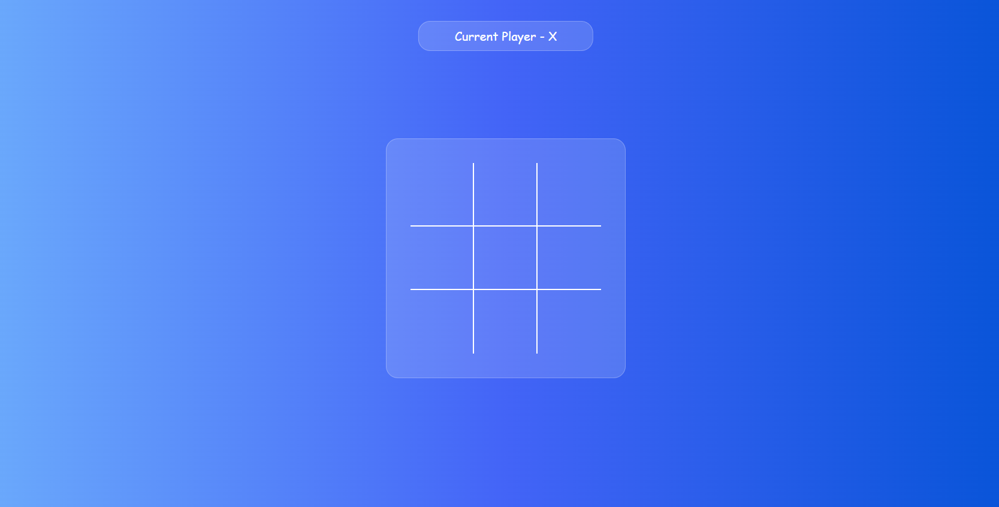
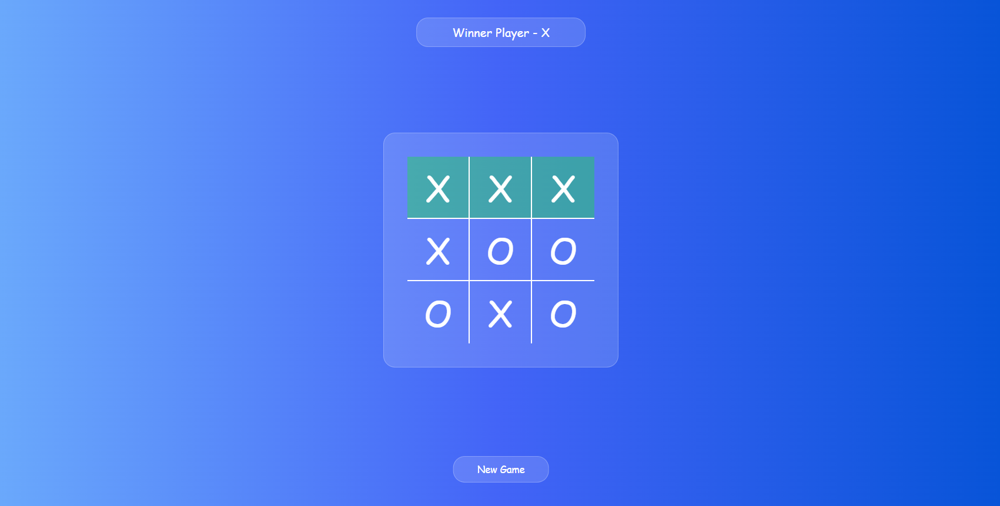

# Tic Tac Toe Game

This is a simple Tic Tac Toe game built using HTML, CSS, and JavaScript. 

## Overview

Tic Tac Toe is a classic game where two players take turns marking spaces in a 3x3 grid. The player who succeeds in placing three of their marks in a horizontal, vertical, or diagonal row wins the game.

## Features

- **Responsive Design**: The game is designed to be responsive and playable on both desktop and mobile devices.
- **Interactive Gameplay**: Players can click on the grid to place their mark.
- **Win Detection**: The game automatically detects when a player has won and highlights the winning combination.
- **Reset Option**: Players can reset the game board at any time to start a new game.

## Technologies Used

- **HTML**: Used for structuring the game layout.
- **CSS**: Utilized for styling the game interface.
- **JavaScript**: Implemented the game logic and functionality.

## How to Play

1. Open the game in a web browser.
2. Two players take turns clicking on an empty cell to place their mark (X or O).
3. The first player to align three of their marks horizontally, vertically, or diagonally wins the game.
4. If all cells are filled and no player has won, the game ends in a draw.
5. To start a new game, click the **New Game** button.

## Screenshots

## Demo

You can try the game live [here]().

